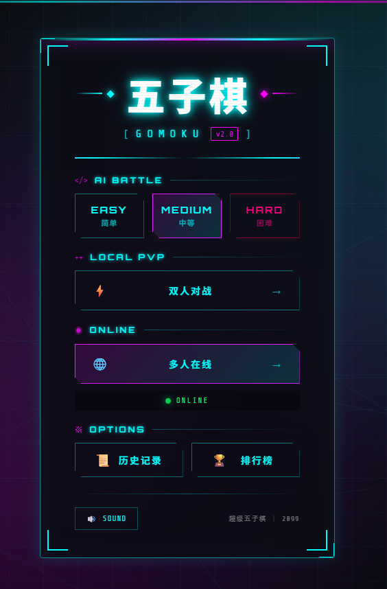
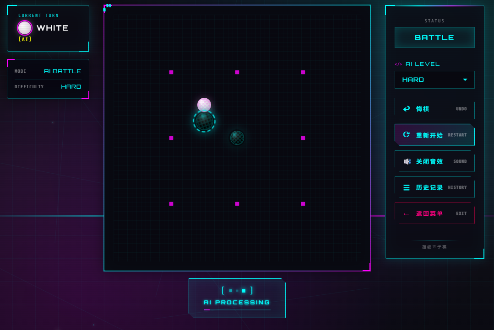
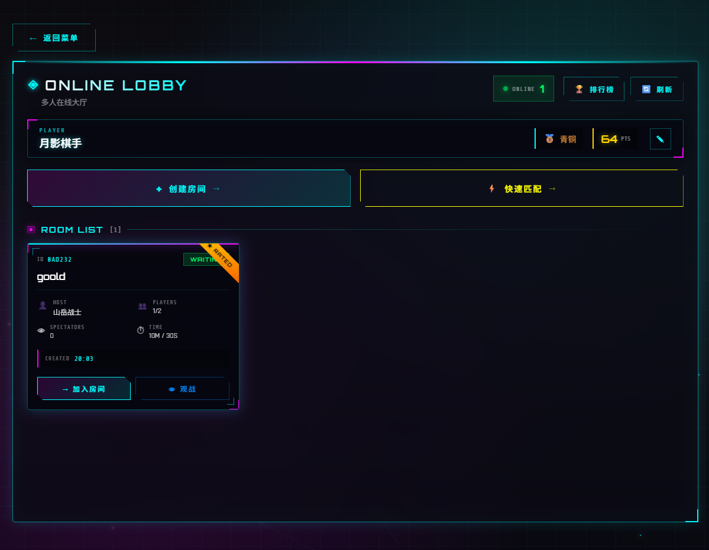
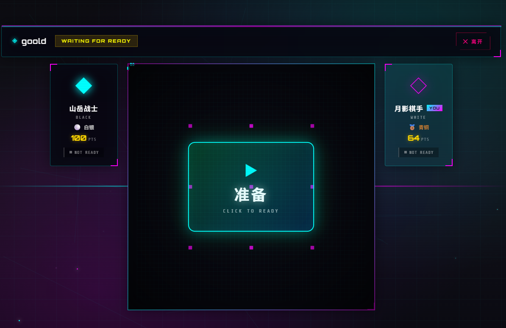
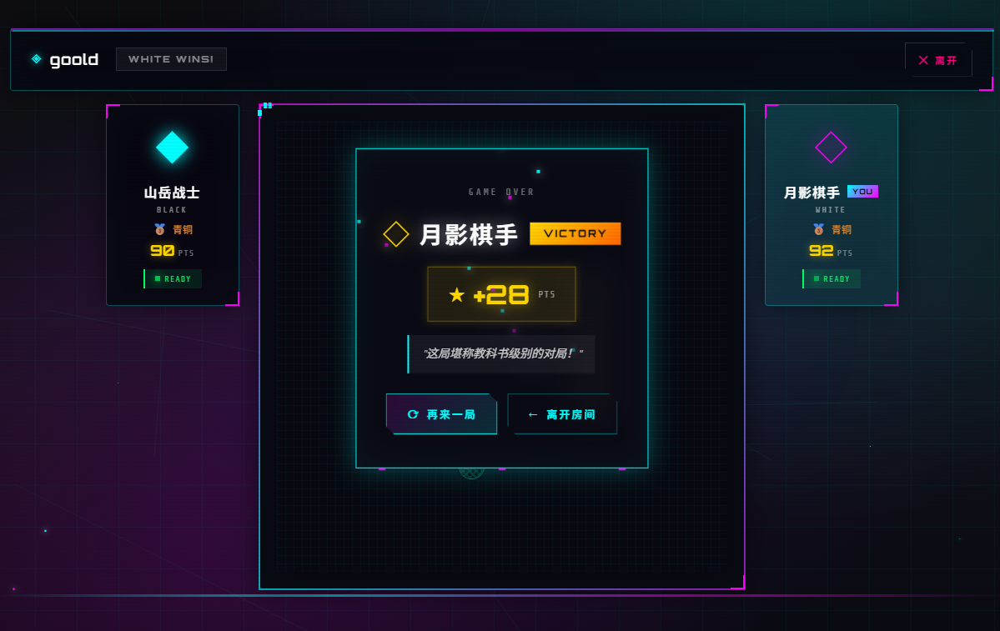

# 五子棋在线对战平台 / Online Gomoku Hall

[简体中文](#简体中文) | [English](#english)

---

## Screenshots / 游戏截图

### 主菜单 / Main Menu


The main menu with cyberpunk-style glassmorphism design, allowing players to choose between single player (AI), local PvP, or online multiplayer modes.

### 人机对战 / AI Battle


Play against AI with three difficulty levels (Easy, Medium, Hard). Features traditional wooden board with grid lines and 3D chess pieces.

### 在线大厅 / Online Lobby


Browse and join game rooms, or create your own. View room status, player ratings, and spectate ongoing matches.

### 多人对战 / Multiplayer Battle


Real-time online gameplay with timer system, rating calculation, and emoji interactions between players.

### 游戏结算 / Game Over


Game result screen showing winner, score changes, and ELO rating updates.

---

<a name="简体中文"></a>

## 简体中文

一个现代化的五子棋（Gomoku）在线对战平台，采用赛博朋克风格的玻璃拟态UI设计，支持人机对战、本地双人及多人在线对战。


### 功能特性

#### 游戏模式

##### 单机模式
- **AI对战**：三种难度级别
  - 简单：随机落子 + 基础攻防
  - 中等：启发式棋型评估
  - 困难：Minimax + Alpha-Beta剪枝（4层深度）
- **本地双人**：同一设备上的双人对战

##### 在线多人模式
- **房间系统**：创建/加入游戏房间
- **观战功能**：观看其他玩家的对局
- **实时对战**：WebSocket实时通信
- **计时系统**：
  - 每人总时间限制（默认10分钟）
  - 每步限时（默认30秒）
- **计分系统**：ELO积分排名
- **段位系统**：青铜 → 白银 → 黄金 → 钻石 → 大师
- **表情互动**：对局中发送表情

#### 游戏功能
- 15×15标准棋盘
- 悔棋功能（单机模式）
- 游戏历史记录与复盘
- 音效系统
- 获胜连线高亮显示

#### UI设计
- 赛博朋克风格
- 玻璃拟态效果
- 流畅动画
- 响应式设计（支持移动端）

### 游戏规则

#### 基本规则
1. 黑子先行，双方轮流落子
2. 先连成五子（横、竖、斜）的一方获胜
3. 棋盘大小为15×15

#### 在线对战规则
1. 房主创建房间并设置游戏参数
2. 第二位玩家加入房间
3. 双方都点击"准备"后游戏开始
4. 超时或断线判负
5. 游戏中途离开判负并扣分

#### 计分规则
- 获胜：+25分（基础）+ 击败高分玩家额外加分
- 失败：-20分
- 弃权/断线：额外扣分

### 技术栈

#### 前端
- **Vue 3** - 渐进式JavaScript框架
- **TypeScript** - 类型安全
- **Vite** - 下一代构建工具
- **Composition API** - 组合式API

#### 后端
- **Go 1.21+** - 高性能服务端
- **Gorilla WebSocket** - 实时通信
- **单文件部署** - 静态资源嵌入

### 安装与运行

#### 方式一：下载预编译包（推荐）

前往 [Releases](https://github.com/your-username/online-gomoku-hall/releases) 页面下载适合您系统的版本：

| 平台 | 文件名 |
|------|--------|
| Windows (64位) | `gomoku-windows-amd64.exe` |
| Windows (ARM64) | `gomoku-windows-arm64.exe` |
| macOS (Intel) | `gomoku-darwin-amd64` |
| macOS (Apple Silicon) | `gomoku-darwin-arm64` |
| Linux (64位) | `gomoku-linux-amd64` |
| Linux (ARM64) | `gomoku-linux-arm64` |

运行：
```bash
# Windows
gomoku-windows-amd64.exe

# macOS/Linux
chmod +x gomoku-linux-amd64
./gomoku-linux-amd64
```

访问 http://localhost:8080 即可开始游戏。

#### 方式二：从源码构建

##### 环境要求
- Node.js 18+
- Go 1.21+
- npm 或 pnpm

##### 构建步骤

```bash
# 1. 克隆仓库
git clone https://github.com/your-username/online-gomoku-hall.git
cd online-gomoku-hall

# 2. 安装前端依赖
npm install

# 3. 构建前端
npm run build

# 4. 构建后端
cd server
go build -o gomoku-server ./cmd

# 5. 运行
./gomoku-server
```

#### 配置选项

支持命令行参数和环境变量：

```bash
# 命令行参数
./gomoku-server -port 8080 -host 0.0.0.0 -data ./data

# 环境变量
PORT=8080 HOST=0.0.0.0 ./gomoku-server
```

| 参数 | 环境变量 | 默认值 | 说明 |
|------|----------|--------|------|
| `-port` | `PORT` | 8080 | 监听端口 |
| `-host` | `HOST` | 0.0.0.0 | 监听地址 |
| `-data` | - | ./data | 数据存储目录 |

### 项目结构

```
online-gomoku-hall/
├── src/                        # 前端源码
│   ├── components/             # Vue组件
│   │   ├── GameBoard.vue       # 棋盘组件
│   │   ├── ChessPiece.vue      # 棋子组件
│   │   ├── GameControls.vue    # 游戏控制
│   │   ├── Lobby.vue           # 多人大厅
│   │   ├── GameRoom.vue        # 游戏房间
│   │   ├── Leaderboard.vue     # 排行榜
│   │   └── ...
│   ├── composables/            # 组合式函数
│   │   ├── useGame.ts          # 游戏状态
│   │   ├── useAI.ts            # AI算法
│   │   ├── useWebSocket.ts     # WebSocket
│   │   └── ...
│   ├── types/                  # TypeScript类型
│   └── styles/                 # 样式文件
├── server/                     # 后端源码
│   ├── cmd/                    # 入口
│   │   ├── main.go             # 主程序
│   │   └── static/             # 前端构建输出
│   └── internal/               # 内部模块
│       ├── game/               # 游戏逻辑
│       ├── room/               # 房间管理
│       ├── player/             # 玩家管理
│       ├── leaderboard/        # 排行榜
│       ├── message/            # 消息类型
│       └── server/             # WebSocket服务器
├── package.json                # 前端依赖
└── vite.config.ts              # Vite配置
```

### 开发指南

#### 开发模式

```bash
# 启动前端开发服务器
npm run dev

# 启动后端服务器（新终端）
cd server
go run ./cmd/main.go
```

#### 类型检查

```bash
npx vue-tsc --noEmit
```

#### 构建生产版本

```bash
npm run build
```

### API 概览

#### WebSocket 消息类型

| 类型 | 方向 | 说明 |
|------|------|------|
| `enter_lobby` | C→S | 进入大厅 |
| `create_room` | C→S | 创建房间 |
| `join_room` | C→S | 加入房间 |
| `spectate` | C→S | 观战 |
| `ready` | C→S | 准备 |
| `move` | C→S | 落子 |
| `emoji` | C→S | 发送表情 |
| `room_update` | S→C | 房间状态更新 |
| `game_over` | S→C | 游戏结束 |
| `time_update` | S→C | 时间更新 |
| `leaderboard_update` | S→C | 排行榜更新 |

### 贡献

欢迎提交 Issue 和 Pull Request！

1. Fork 本仓库
2. 创建功能分支 (`git checkout -b feature/amazing-feature`)
3. 提交更改 (`git commit -m 'Add amazing feature'`)
4. 推送到分支 (`git push origin feature/amazing-feature`)
5. 创建 Pull Request

### 许可证

本项目采用 [MIT](./LICENSE) 许可证。

---

<a name="english"></a>

## English

A modern online Gomoku (Five in a Row) battle platform with cyberpunk-style glassmorphism UI design, featuring AI battles, local PvP, and online multiplayer.


### Features

#### Game Modes

##### Single Player
- **AI Battle**: Three difficulty levels
  - Easy: Random moves + basic offense/defense
  - Medium: Heuristic pattern evaluation
  - Hard: Minimax with Alpha-Beta pruning (4-ply depth)
- **Local PvP**: Two players on the same device

##### Online Multiplayer
- **Room System**: Create/Join game rooms
- **Spectate**: Watch other players' games
- **Real-time Battle**: WebSocket real-time communication
- **Timer System**:
  - Total time per player (default: 10 minutes)
  - Move time limit (default: 30 seconds)
- **Rating System**: ELO-based ranking
- **Rank Tiers**: Bronze → Silver → Gold → Diamond → Master
- **Emoji Interaction**: Send emojis during games

#### Game Features
- Standard 15×15 board
- Undo function (single player mode)
- Game history and replay
- Sound effects
- Winning line highlight

#### UI Design
- Cyberpunk aesthetic
- Glassmorphism effects
- Smooth animations
- Responsive design (mobile friendly)

### Game Rules

#### Basic Rules
1. Black moves first, players take turns
2. First to connect five pieces (horizontal, vertical, diagonal) wins
3. Board size: 15×15

#### Online Battle Rules
1. Host creates room and sets game parameters
2. Second player joins the room
3. Game starts when both players click "Ready"
4. Timeout or disconnection results in loss
5. Leaving mid-game counts as forfeit and rating penalty

#### Scoring Rules
- Win: +25 points (base) + bonus for defeating higher-rated players
- Loss: -20 points
- Forfeit/Disconnect: Additional penalty

### Tech Stack

#### Frontend
- **Vue 3** - Progressive JavaScript framework
- **TypeScript** - Type safety
- **Vite** - Next generation build tool
- **Composition API** - Composable logic

#### Backend
- **Go 1.21+** - High-performance server
- **Gorilla WebSocket** - Real-time communication
- **Single binary deployment** - Embedded static assets

### Installation & Running

#### Option 1: Download Pre-built Binary (Recommended)

Visit the [Releases](https://github.com/your-username/online-gomoku-hall/releases) page to download the version for your system:

| Platform | Filename |
|----------|----------|
| Windows (x64) | `gomoku-windows-amd64.exe` |
| Windows (ARM64) | `gomoku-windows-arm64.exe` |
| macOS (Intel) | `gomoku-darwin-amd64` |
| macOS (Apple Silicon) | `gomoku-darwin-arm64` |
| Linux (x64) | `gomoku-linux-amd64` |
| Linux (ARM64) | `gomoku-linux-arm64` |

Run:
```bash
# Windows
gomoku-windows-amd64.exe

# macOS/Linux
chmod +x gomoku-linux-amd64
./gomoku-linux-amd64
```

Visit http://localhost:8080 to start playing.

#### Option 2: Build from Source

##### Requirements
- Node.js 18+
- Go 1.21+
- npm or pnpm

##### Build Steps

```bash
# 1. Clone the repository
git clone https://github.com/your-username/online-gomoku-hall.git
cd online-gomoku-hall

# 2. Install frontend dependencies
npm install

# 3. Build frontend
npm run build

# 4. Build backend
cd server
go build -o gomoku-server ./cmd

# 5. Run
./gomoku-server
```

#### Configuration Options

Supports command-line arguments and environment variables:

```bash
# Command-line arguments
./gomoku-server -port 8080 -host 0.0.0.0 -data ./data

# Environment variables
PORT=8080 HOST=0.0.0.0 ./gomoku-server
```

| Flag | Env Variable | Default | Description |
|------|--------------|---------|-------------|
| `-port` | `PORT` | 8080 | Listen port |
| `-host` | `HOST` | 0.0.0.0 | Listen address |
| `-data` | - | ./data | Data storage directory |

### Project Structure

```
online-gomoku-hall/
├── src/                        # Frontend source
│   ├── components/             # Vue components
│   │   ├── GameBoard.vue       # Board component
│   │   ├── ChessPiece.vue      # Chess piece
│   │   ├── GameControls.vue    # Game controls
│   │   ├── Lobby.vue           # Multiplayer lobby
│   │   ├── GameRoom.vue        # Game room
│   │   ├── Leaderboard.vue     # Leaderboard
│   │   └── ...
│   ├── composables/            # Composable functions
│   │   ├── useGame.ts          # Game state
│   │   ├── useAI.ts            # AI algorithms
│   │   ├── useWebSocket.ts     # WebSocket
│   │   └── ...
│   ├── types/                  # TypeScript types
│   └── styles/                 # Styles
├── server/                     # Backend source
│   ├── cmd/                    # Entry point
│   │   ├── main.go             # Main program
│   │   └── static/             # Frontend build output
│   └── internal/               # Internal modules
│       ├── game/               # Game logic
│       ├── room/               # Room management
│       ├── player/             # Player management
│       ├── leaderboard/        # Leaderboard
│       ├── message/            # Message types
│       └── server/             # WebSocket server
├── package.json                # Frontend dependencies
└── vite.config.ts              # Vite config
```

### Development Guide

#### Development Mode

```bash
# Start frontend dev server
npm run dev

# Start backend server (new terminal)
cd server
go run ./cmd/main.go
```

#### Type Checking

```bash
npx vue-tsc --noEmit
```

#### Production Build

```bash
npm run build
```

### API Overview

#### WebSocket Message Types

| Type | Direction | Description |
|------|-----------|-------------|
| `enter_lobby` | C→S | Enter lobby |
| `create_room` | C→S | Create room |
| `join_room` | C→S | Join room |
| `spectate` | C→S | Spectate game |
| `ready` | C→S | Ready |
| `move` | C→S | Make move |
| `emoji` | C→S | Send emoji |
| `room_update` | S→C | Room state update |
| `game_over` | S→C | Game over |
| `time_update` | S→C | Time update |
| `leaderboard_update` | S→C | Leaderboard update |

### Contributing

Issues and Pull Requests are welcome!

1. Fork this repository
2. Create a feature branch (`git checkout -b feature/amazing-feature`)
3. Commit your changes (`git commit -m 'Add amazing feature'`)
4. Push to the branch (`git push origin feature/amazing-feature`)
5. Create a Pull Request

### License

This project is licensed under the [MIT](./LICENSE) License.

---

## Acknowledgments / 致谢

- [Vue.js](https://vuejs.org/)
- [Vite](https://vitejs.dev/)
- [Go](https://golang.org/)
- [Gorilla WebSocket](https://github.com/gorilla/websocket)
